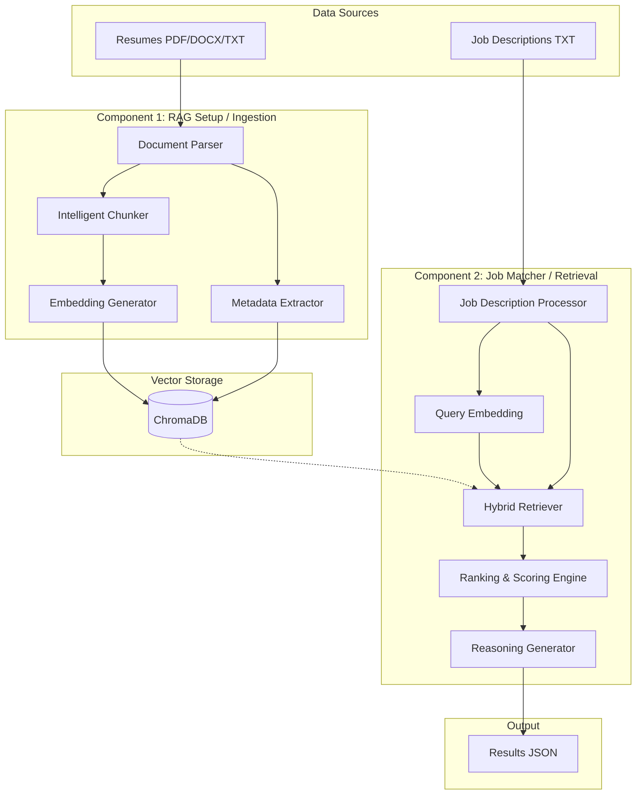

# Resume RAG System - Architecture Document

## 1. System Overview

The Resume RAG (Retrieval-Augmented Generation) System is a local, lightweight tool designed to match candidate resumes against job descriptions. It uses semantic search, keyword matching, and a vector database to retrieve, rank, and reason about the most suitable candidates.

The system is strictly designed to run directly on the host machine's global Python installation. **No virtual environments** will be used. Users must install Python 3.x and the required dependencies globally on their system.

## 2. Architecture Diagram

## 3. Core Components

### 3.1 Part A: Resume Ingestion (`resume_rag.py`)
Responsible for processing raw resumes and populating the vector database.
*   **Document Parser:** Extracts raw text from `.pdf`, `.docx`, and `.txt` files.
*   **Intelligent Chunker:** Splits the extracted text logically based on resume sections (Summary, Experience, Education, Skills, etc.) rather than random character counts.
*   **Metadata Extractor:** Extracts structured data (Name, Skills, Years of Experience, Education) for filtering and rule-based matching.
*   **Embedding Generator:** Uses the `sentence-transformers/all-MiniLM-L6-v2` model to convert text chunks into dense vector representations.
*   **ChromaDB Storage:** Stores embeddings, chunk texts, and metadata locally in a persistent Chroma database.

### 3.2 Part B: Job Matching Engine (`job_matcher.py`)
Responsible for evaluating job descriptions against the stored resumes.
*   **Query Processor:** Reads the target job description and converts it into a vector embedding using the same `sentence-transformers` model.
*   **Hybrid Search Retriever:** Queries ChromaDB using a combination of Semantic Similarity (vectors) and Keyword Matching (critical skills).
*   **Must-Have Filter:** Applies hard constraints (e.g., minimum experience years, mandatory skills) derived from the metadata to immediately eliminate unqualified candidates.
*   **Ranking Engine:** Calculates a final normalized score (0-100) based on a weighted formula (e.g., 70% Semantic, 30% Keyword).
*   **Reasoning Generator:** Produces a human-readable explanation of why a candidate matched, referencing specific skills and text excerpts.
*   **Output Writer:** Saves the top 10 candidates and their match reasoning to `data/output/` as a JSON file.

## 4. Technology Stack
*   **Language:** Python 3.x (System-wide installation, no virtual environments)
*   **Embeddings:** `sentence-transformers` (`all-MiniLM-L6-v2`) - Free, local, no API keys needed.
*   **Vector Database:** `chromadb` - Persistent local storage.
*   **Document Parsing:** `pypdf`, `python-docx`
*   **Utilities:** `re`, `pathlib`

## 5. Execution Workflow Constraints
1.  **System Requirements:** The user is responsible for having Python installed globally on their system.
2.  **Dependencies:** Dependencies will be installed globally via `pip install -r requirements.txt`. 
3.  **Local Execution:** The system requires no cloud API calls. The embedding model and ChromaDB run entirely on the local hardware.
4.  **Two-Step Process:** 
    *   First, the user must run `python resume_rag.py` to index the resumes.
    *   Second, the user must run `python job_matcher.py <job_description_filename.txt>` to evaluate the specific job description and generate the output results.
